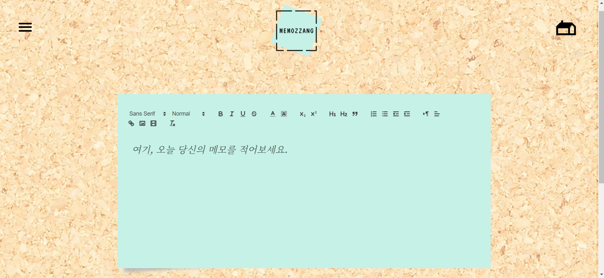

# memozzang project

 
 
만든이 : 김린아 
메일 : aem205@gmail.com 
 
 
## 목차
* 들어가며
  1. 프로젝트 소개  
    1-1. 프로젝트 기능
    1-2. 개발 환경
    
* Front-End
  1. 컴포넌트 구성
  
* Back-End(Spring Framework)
  1. DataBase 테이블 설계
  2. Spring 설정파일 구성  
    2-1. web.xml 
    2-2. servlet-context.xml
  3. View 구성
  4. Controller 구성
  5. Model 구성 
    5-1. DTO 구성  
    5-2. DAO 구성 
  6. Interceptor 구성
  
* 마치며
  1. 프로젝트 보완사항
  2. 소감

## 들어가며
 #### 1. 프로젝트 소개
 
&nbsp;&nbsp;본 프로젝트를 시작하게 된 계기는 웹 프로그래밍의 기본 소양이라 할 수 있는 기본적인 기능인 CRUD가 가능한 메모장 사이트를 목적으로 개발하게 된 프로젝트 입니다. 혼자 독학으로 관련 기술들을 학습한 이후 2주간 제작한 개인 프로젝트 입니다. 아직은 다소 미흡하지만 기본기능은 다 구현한 프로젝트 입니다.
     
   #### 1-1. 프로젝트 기능
   
&nbsp;&nbsp;
    
  * 기본 기능(CRUD)
    * 메모를 작성하여 DataBase에 저장한다.
    * DataBase에서 메모를 조회하여 웹 페이지 상에 표시한다.
    * 메모를 수정하여 DataBase에 저장한다.
    * 메모를 삭제할 시 DataBase에서 삭제한다.
    
  * 추가 기능
    * Spring security를 사용하여 웹 페이지 이용자를 2가지(Admin, Member)로 분류. 
      분류된 사용자들에게 제한된 기능을 제공(Admin으로 role을 분류는 해놓았지만 관리자페이지 현재 미개발). 
     Admin - 관리자 기능 
     Member - memozzang crud가 가능한 user 기능
    * Spring security를 사용하여 비밀번호 암호화로 가입 후 로그인 기능.
    * 한눈에 모아보기 화면에서 페이징 처리를 통해 한 페이지 당 보여주는 게시물의 수를 5개로 제한.
    * 한눈에 모아보기 화면에서 페이징 처리를 ajax로 하여, 페이지 더보기를 동적으로 구현
    * 한눈에 모아보기 화면에서 특정 게시물을 제목+내용으로 검색이 가능하게 함.
    * ajax로 북마크를 구현하여, 실시간으로 북마크를 저장 가능.
    * 북마크 모아보기 화면에서 사용자가 북마크한 북마크를 모아볼 수 있음.  
    
  * API 기능
    * quill editor 사용으로 본 프로젝트에 맞게 커스터 마이징 하여 다양한 html 메모효과 기능 구현.
    * fullcalendar 사용으로 달력으로 날짜별로 사용자가 글쓴 메모 확인 가능.
    * Google Chart 사용으로 사용자가 날짜별로 언제 글을 많이 썼는지 확인 가능.
    * d3.js wordcloud 사용으로 사용자가 가장 많이 쓴 키워드를 확인 가능.  
    
    
   #### 1-2. 개발 환경
    
  &nbsp;&nbsp;운영 체제: window10 
  &nbsp;&nbsp;IDE: Eclipse 4.12.0 
  &nbsp;&nbsp;Back-end: Spring Framework 5.1.4.RELEASE, Spring security 4.1.3.RELEASE, myBatis 3.5.6, Tomcat 8.5  
  &nbsp;&nbsp;Data Base: Oracle 11g Release 11.2.0.1.0, Sql Developer 19.2.1.247 
  &nbsp;&nbsp;Web browser: Chrome 
    

   
