# memozzang project

 
 
만든이 : 김린아 
메일 : aem205@gmail.com 
 
 
## 목차
* 들어가며
  1. 프로젝트 소개  
    1-1. 프로젝트 기능
    1-2. 개발 환경
    
* DataBase 테이블 설계
  1. DB 테이블 구성도
  
* 메뉴 및 기능 설명
  1. 메인
  2. 회원가입 및 로그인
  3. 나의메모 모아보기
  4. 타인메모 모아보기
  5. 회원정보수정
  
* 마치며
  1. 프로젝트 보완사항
  2. 소감

## 들어가며
 #### 1. 프로젝트 소개
 
&nbsp;&nbsp;본 프로젝트를 시작하게 된 계기는 웹 프로그래밍의 기본 소양이라 할 수 있는 기본적인 기능인 CRUD가 가능한 메모장 사이트를 목적으로 개발하게 된 프로젝트 입니다. 혼자 독학으로 관련 기술들을 학습한 이후 2주간 제작한 개인 프로젝트 입니다. 아직은 다소 미흡하지만 기본기능은 다 구현한 프로젝트 입니다.
     
   #### 1-1. 프로젝트 기능
   
&nbsp;&nbsp;
    
  * 기본 기능(CRUD)
    * 메모를 작성하여 DataBase에 저장한다.
    * DataBase에서 메모를 조회하여 웹 페이지 상에 표시한다.
    * 메모를 수정하여 DataBase에 저장한다.
    * 메모를 삭제할 시 DataBase에서 삭제한다.
    
  * 추가 기능
    * Spring security를 사용하여 웹 페이지 이용자를 2가지(Admin, Member)로 분류. 
      분류된 사용자들에게 제한된 기능을 제공(Admin으로 role을 분류는 해놓았지만 관리자페이지 현재 미개발). 
     Admin - 관리자 기능 
     Member - memozzang crud가 가능한 user 기능
    * Spring security를 사용하여 비밀번호 암호화로 가입 후 로그인 기능.
    * 한눈에 모아보기 화면에서 페이징 처리를 통해 한 페이지 당 보여주는 게시물의 수를 5개로 제한.
    * 한눈에 모아보기 화면에서 페이징 처리를 ajax로 하여, 페이지 더보기를 동적으로 구현
    * 한눈에 모아보기 화면에서 특정 게시물을 제목+내용으로 검색이 가능하게 함.
    * ajax로 북마크를 구현하여, 실시간으로 북마크를 저장 가능.
    * 북마크 모아보기 화면에서 사용자가 북마크한 북마크를 모아볼 수 있음.  
    
  * API 기능
    * quill editor 사용으로 본 프로젝트에 맞게 커스터 마이징 하여 다양한 html 메모효과 기능 구현.
    * fullcalendar 사용으로 달력으로 날짜별로 사용자가 글쓴 메모 확인 가능.
    * Google Chart 사용으로 사용자가 날짜별로 언제 글을 많이 썼는지 확인 가능.
    * d3.js wordcloud 사용으로 사용자가 가장 많이 쓴 키워드를 확인 가능.  
    
    
   #### 1-2. 개발 환경
    
  &nbsp;&nbsp;운영 체제: window10 
  &nbsp;&nbsp;IDE: Eclipse 4.12.0 
  &nbsp;&nbsp;Back-end: Spring Framework 5.1.4.RELEASE, Spring security 4.1.3.RELEASE, myBatis 3.5.6, Tomcat 8.5  
  &nbsp;&nbsp;Data Base: Oracle 11g Release 11.2.0.1.0, Sql Developer 19.2.1.247 
  &nbsp;&nbsp;Web browser: Chrome 
  
  
## DataBase 테이블 설계
 #### 1. DB 테이블 구성도
 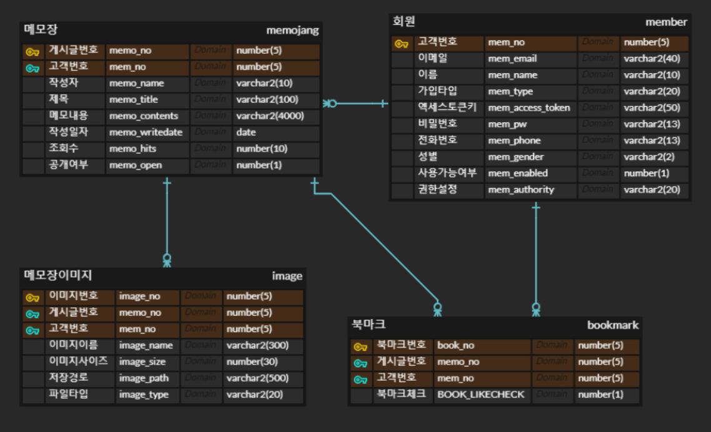

## 메뉴 및 기능 설명
 #### 1. 메인
 
 메인화면이다. 
 
 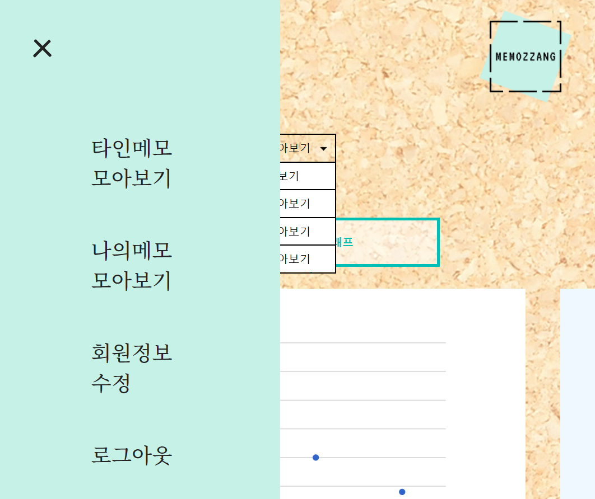
 왼쪽 햄버거 버튼을 클릭하면 데코레이션을 고정시킨 메뉴가 나온다. 
 
 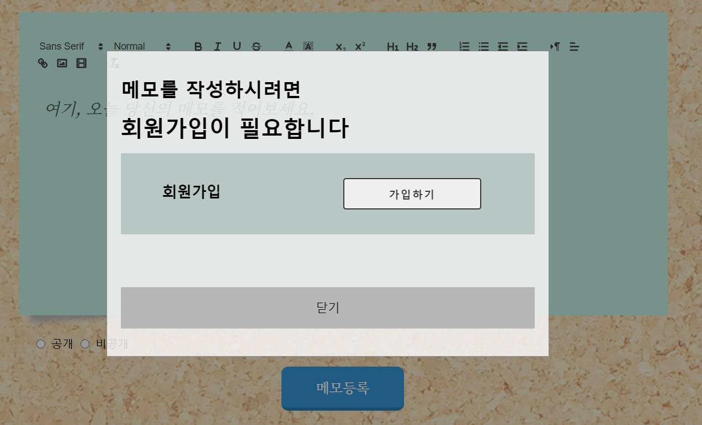
 로그인 하지 않은 상태에서 등록 버튼을 누르게 되면 회원가입 모달 화면창이 뜸. 
 
 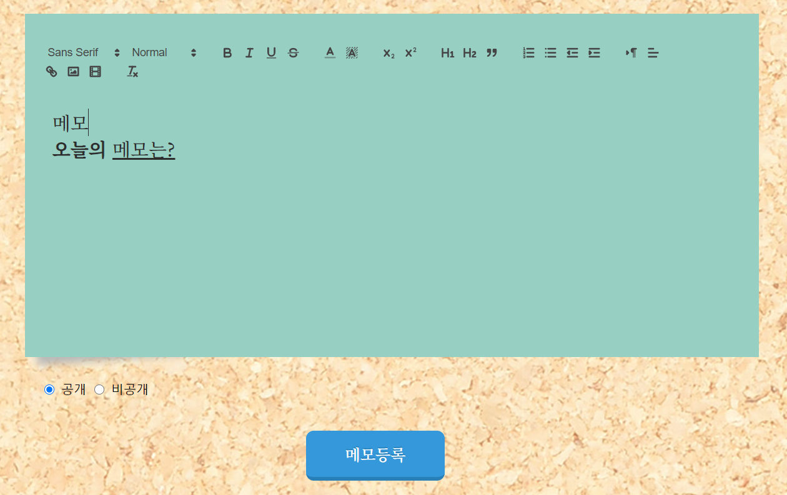
 회원가입을 하고나서 로그인한 상태의 메모 등록 화면(메인) 이며, quill editor 사용으로 다양한 html 효과로 저장 및 보기 가능. 
 
 #### 2. 회원가입 및 로그인
 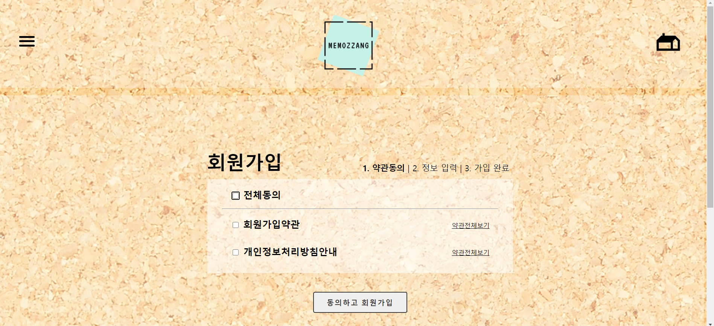
 회원가입 약관 동의 화면이다. 상단의 체크박스를 클릭하면 모두 선택되게 구현함. 
 
 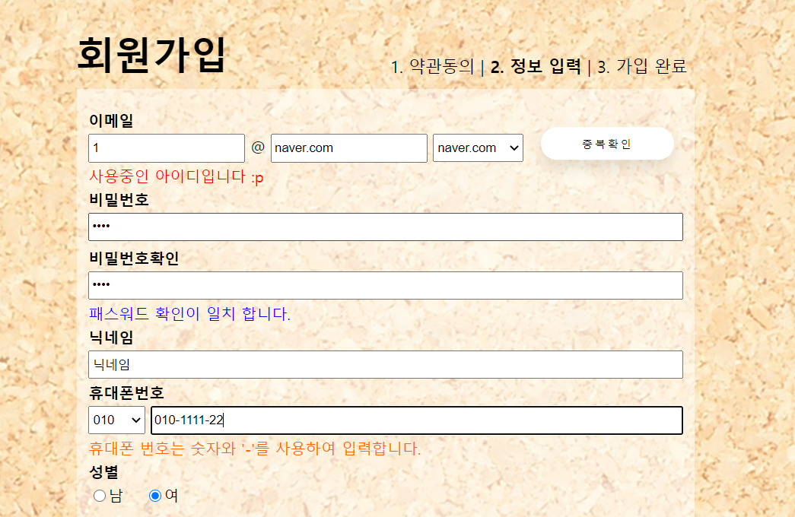
 회원가입 화면이다. 전체적으로 정규식을 사용하여 유효성 검사를 하도록 구현함. 
 이메일 - ajax를 사용하여 중복확인을 누르면 현재 사용 가능한 ID 인지 확인이 가능. 
 비밀번호 - ajax를 사용하여 패스워드를 한번더 체크 가능. 
 휴대폰번호 - ajax를 사용하여 정규식에 해당하는 문자만 입력 가능 하게 구현.  
 
 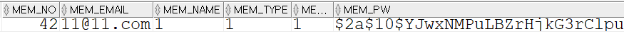
 Spring security의 bcryptPasswordEncoder 암호화 방식으로 회원가입을 하게되면 DB에 다음과 같이 비밀번호가 저장된다. 
 
 #### 3. 나의메모 모아보기
 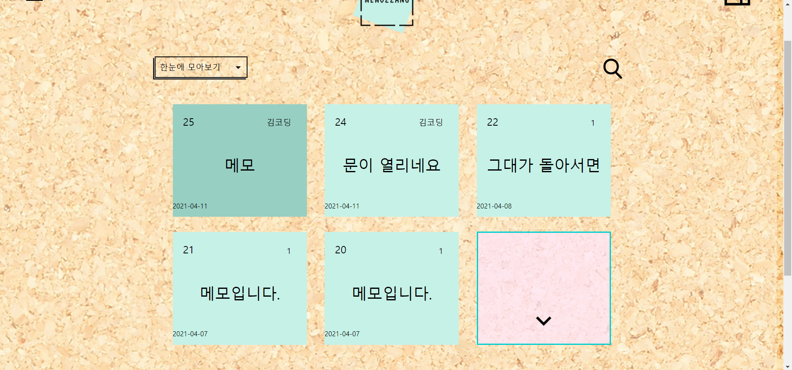
 한눈에 모아보기 화면이다. ajax로 페이징을 구현하여, 기본으로 5개씩 보이게끔 하고 더보기도 동적으로 구현하였다. 
 현재 화면에서 메모지를 클릭하면 메모 고유 번호를 전달하여 메모를 하나씩 읽을 수 있다. 
 
 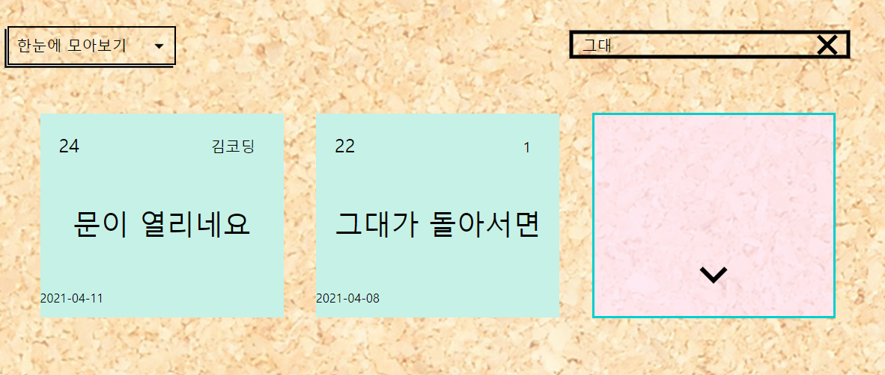
 상단의 돋보기 버튼을 클릭한 후 검색할 키워드를 적어서 엔터키를 누르면 검색과 동시에 정렬이 새로 되게 구현함. 
 
 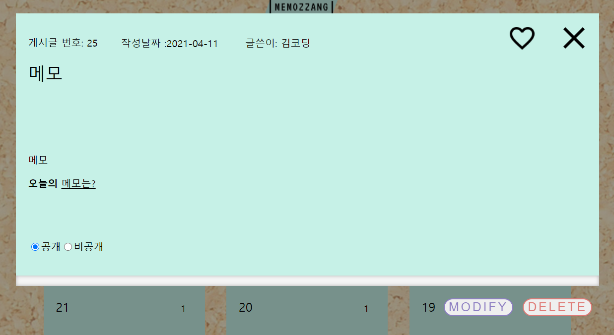
 메모 read 화면. 상단의 하트버튼을 누르면 북마크가 된다. 하단의 수정&삭제 버튼으로 수정과 삭제를 할 수 있음. 
 
 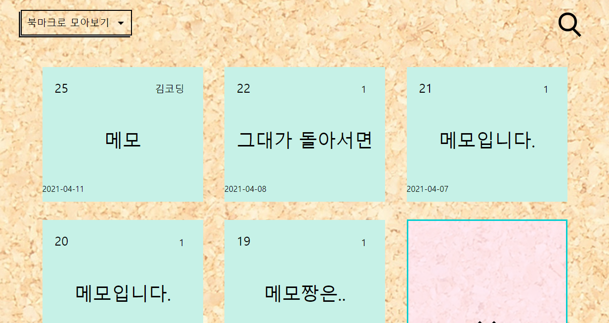
 북마크로 모아보기 화면이다. 사용자가 북마크 한 메모들이 모여져있는 화면이다.
 
 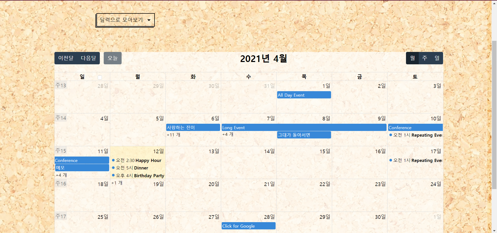
 캘린더로 모아보기 화면이다. full calendar api를 사용하였다. 사용자가 글쓴 날짜에 맞춰서 달력으로 확인할 수 있다. 
 
 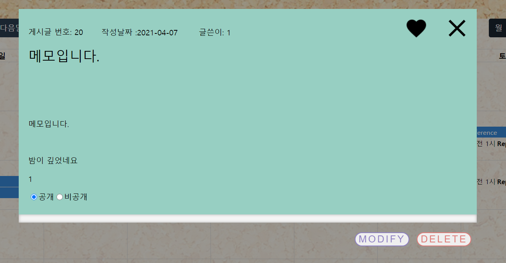
 캘린더로 모아보기 에서도 사용자가 글쓴 날짜의 메모를 클릭해서 하나씩 읽을 수 있다. 
 
 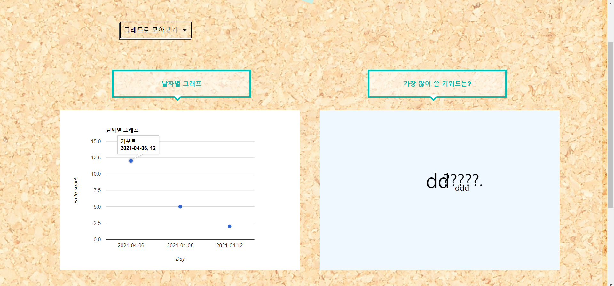
 차트로 모아보기 화면이다. 왼쪽의 날짜별 그래프는 Google chart, 오른쪽의 가장 많이 쓴 키워드 그래프는 d3.js wordcloud로 구현하였다. 
 차트로 모아봄 으로써 사용자의 데이터 시각화를 증가시켰다.  
 
 #### 4. 타인메모 모아보기
 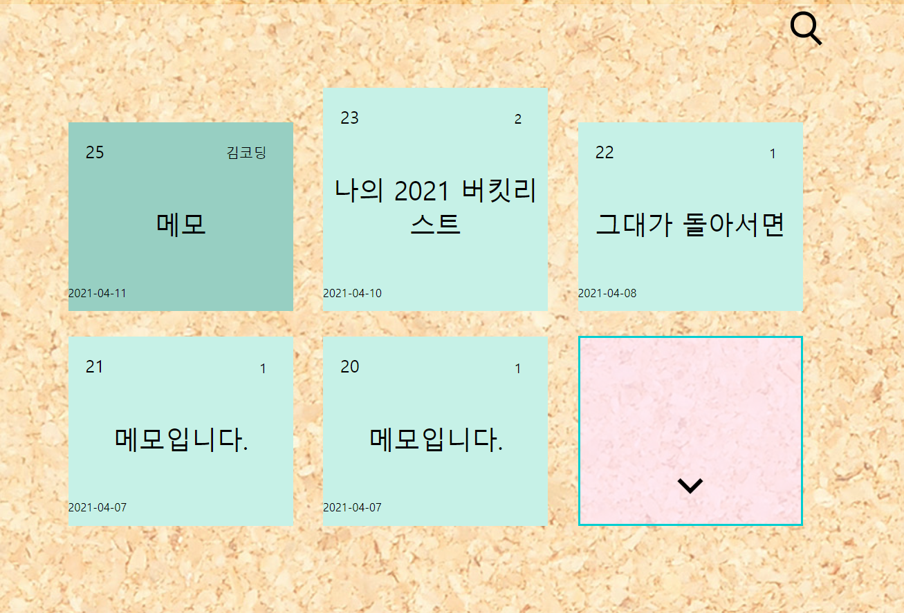
 타인메모 모아보기 화면이다. 비로그인 상태에서도 확인 할 수 있다. 타인메모는 공개된 게시물 중 북마크에 등록된 기준으로 게시가 된다.  
 
 #### 5. 회원정보수정
 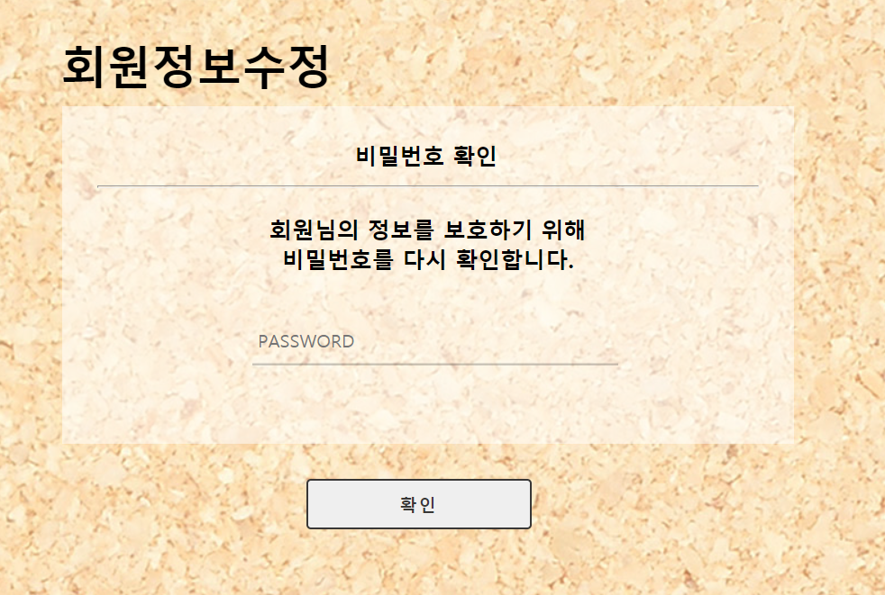
 회원정보수정 전 비밀번호 확인으로 한번 더 검증하였다. 
 
 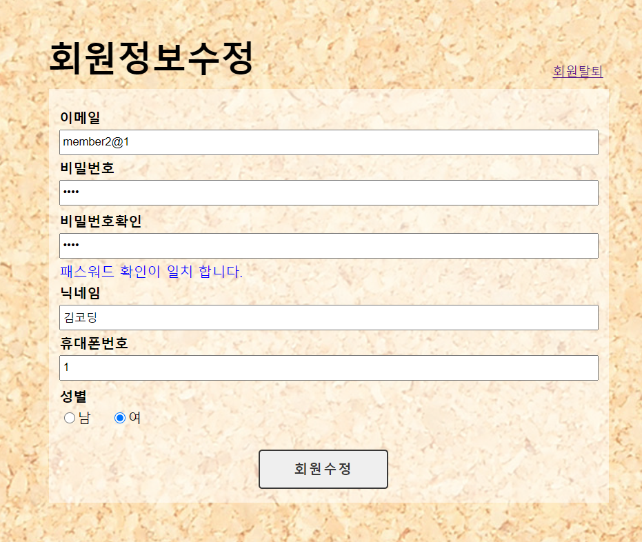
 회원정보수정 화면이다. 회원 가입과 기능이 비슷하다. 
 
 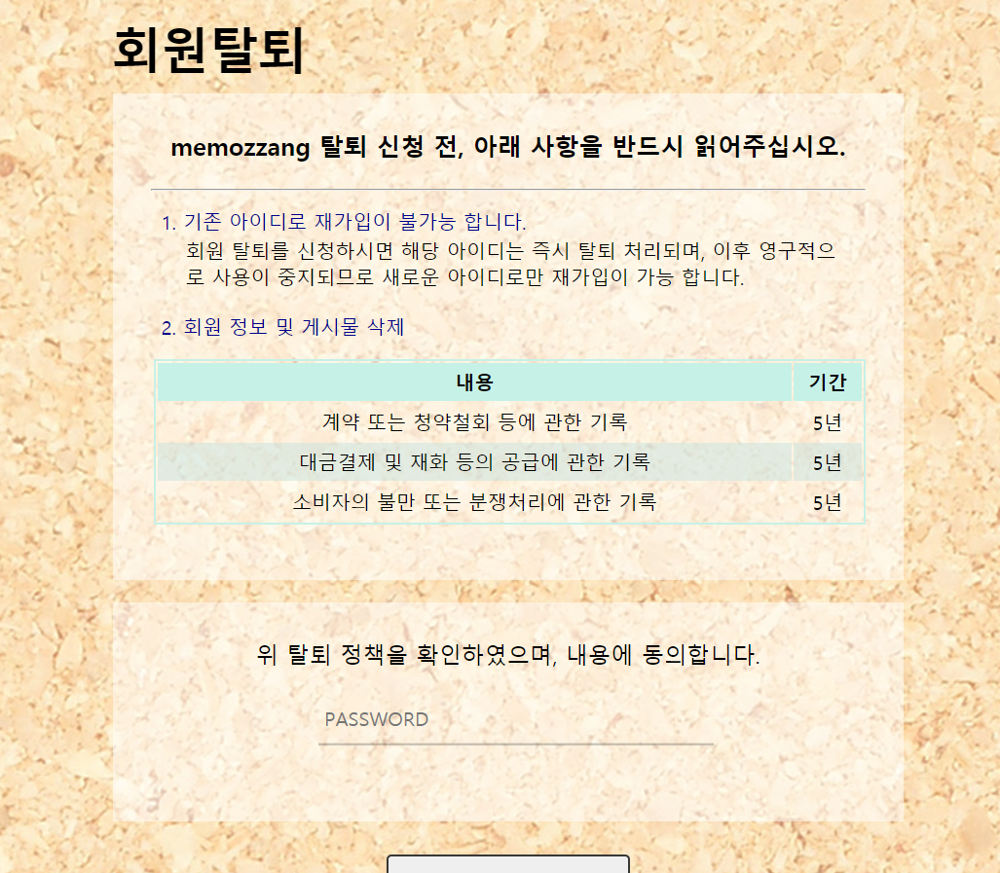
 회원정보수정 화면에서 상단의 회원탈퇴를 클릭하면 나오는 회원탈퇴 페이지이다. 
 
 
 
